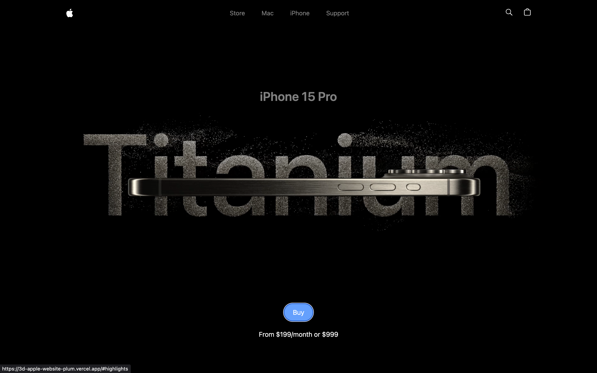
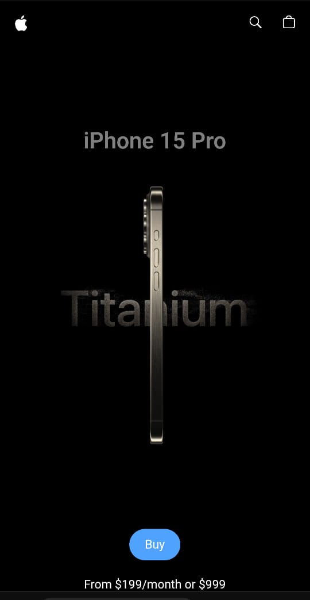

# 🍎 3D Apple Product Showcase

A visually immersive, animated, and scroll-synced **Apple-inspired 3D product website** built with **React**, **Tailwind CSS**, and **GSAP ScrollTrigger**. Experience a smooth, responsive, and premium product page clone with animated transitions and 3D showcase sections.

🔗 **Live Demo:** [3d-apple-website-plum.vercel.app](https://3d-apple-website-plum.vercel.app)

---

## ✨ Features

- 🌐 **Apple-style design** — modern, clean, and minimalist
- 🌀 **GSAP Scroll animations** for buttery-smooth section reveals
- 🎥 **Video carousel** with progress dots and indicator animation
- 🖼️ **Responsive layout** built with Tailwind CSS utility classes
- 🧠 Modular structure using React components
- 🧭 Scroll-synced **parallax effects** and animated transitions
- 💡 Dynamic UI updates with smooth page sections

---

## 🛠️ Tech Stack

- **React** — Component-based UI
- **Tailwind CSS** — Utility-first CSS framework
- **GSAP + ScrollTrigger** — Animation and scroll-based effects
- **Vite** — Fast bundler and dev environment
- **Vercel** — Hosting and CI/CD
- **Three.js** — Animations

---

## 📸 Screenshots

| Desktop View                              | Mobile View                                |
| ----------------------------------------- | ------------------------------------------ |
|  |  |

---

## 📁 Folder Structure

```bash
├── public/
│   ├── assets/
│   │   ├── images/             # Static images used in the app
│   │   └── videos/             # Video assets
│   ├── models/
│   │   └── scene.glb           # 3D model file
│   └── react.svg               # Example logo/icon
│
├── src/
│   ├── components/             # Reusable and page-specific components
│   │   ├── Features.jsx
│   │   ├── Footer.jsx
│   │   ├── Hero.jsx
│   │   ├── Highlights.jsx
│   │   ├── HowItWorks.jsx
│   │   ├── IPhone.jsx
│   │   ├── Lights.jsx
│   │   ├── Loader.jsx
│   │   ├── Model.jsx
│   │   ├── ModelView.jsx
│   │   ├── Navbar.jsx
│   │   └── VideoCarousel.jsx
│   │
│   ├── constants/
│   │   └── index.js            # Constant values (e.g. product data, colors, etc.)
│   ├── utils.js                # General utility functions
│   │    └── index.js
│   │    └── animations.jsx     # GSAP animation configs
│   ├── App.jsx                 # Root React component
│   ├── index.css               # Global styles and Tailwind imports
│   └── main.jsx                # App entry point
│
├── .gitignore
├── index.html
├── package.json
├── package-lock.json
├── postcss.config.js
├── tailwind.config.js
├── vite.config.js
├── eslint.config.js
└── README.md
```

## 🔧 Installation

```bash
git clone https://github.com/Sumiattri/3d_apple_website.git
cd genai-clone
npm install
npm run dev
```

---

## Contact

Created by [@sumitattri](https://github.com/Sumiattri)  
📧 Email: sumitattri165@gmail.com  
🔗 LinkedIn: (https://www.linkedin.com/in/sumit-attri-3147b9257?utm_source=share&utm_campaign=share_via&utm_content=profile&utm_medium=android_app)
